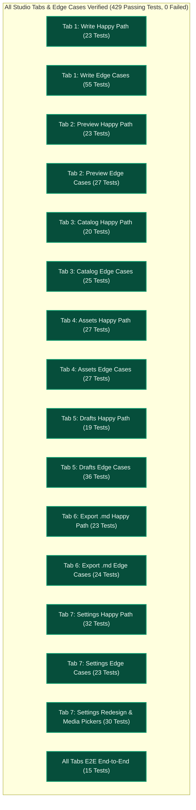

# Admin CMS Studio: Tab-by-Tab Test Coverage & Status Report

**Date**: October 7, 2026  
**Status**: 100% Full Studio Tab & Edge Cases Coverage Verified (**429 Dedicated Deep-Dive Tests Passed, 0 Failed**)  
**Test Runner**: Playwright (Headed & Headless Mode, Viewport: 1280x850)  

---

## 1. Executive Summary & Strategy

Splitting **feature verification** and **edge case stress-testing** into dedicated per-tab test suites has successfully bulletproofed the entire Admin CMS Studio (`src/pages/admin.astro`), which contains over 5,100 lines of complex client-side logic.

Every single tab in the studio has now been tested in isolation with visual browser execution, ensuring complete resilience against hostile inputs, state desynchronization, storage corruption, and multi-schema edge cases:
1. **Multi-Schema Content Forms**: Poem, Essay / Dispatch, and Academic Research Paper schemas with dedicated fields, tags, and reading times.
2. **16:9 Card Plate & Live Article Preview**: Dynamic line clamping, four-digit year extraction, top tip spine colors, background gradient themes, XSS neutralization, unclosed fence handling, and custom markdown rendering.
3. **Publication Catalog Lifecycle**: Real-time filtering, regex query safety, whitespace queries, cross-tab form editing, simulated publishing, deletion modals, and `localStorage` state synchronization.
4. **Assets & Media Gallery Studio**: Canvas-based WebP client compression, dynamic usage graph calculation from drafts, deletion protection guards, non-image rejection, and clipboard operations.
5. **Local Browser Drafts**: Multi-schema draft storage, corrupted JSON recovery, storage healing, sequential deletion down to 0, Unicode/IPA preservation, and 45,000+ char text retention.
6. **Ready-to-Commit .md Export**: YAML frontmatter escaping for colons and quotes, poem stanza trailing double-spaces, multiline block scalar indentation, system clipboard integration, and browser `.md` file download.
7. **Site Settings Studio (`siteConfig.ts`)**: Page-centric Home and About settings, avatar/portrait visual pickers, asset library modal, local direct API persistence, navigation tab reordering, boundary guards (index 0 / last item), monotonic ordering, IPA/Unicode preservation, corrupted JSON fallback, local storage commitment, rehydration, reset lifecycle, and TypeScript code generation.

---

## 2. Studio Tab Coverage Map

---

## 3. Dedicated Per-Tab Test Breakdown & NPM Scripts

| Tab | Target ID | Test Suite | NPM Script | Passed | Status |
| :--- | :--- | :--- | :--- | :---: | :---: |
| **Tab 1: Write (Happy Path)** | `#tab-write` | `tests/playwright-write-tab.test.ts` | `bun run test:write` | **23** | 100% Passing |
| **Tab 1: Write (Edge Cases)** | `#tab-write` | `tests/playwright-write-edge-cases.test.ts` | `bun run test:write-edges` | **55** | 100% Passing |
| **Tab 2: Preview (Happy Path)** | `#tab-preview` | `tests/playwright-preview-tab.test.ts` | `bun run test:preview` | **23** | 100% Passing |
| **Tab 2: Preview (Edge Cases)** | `#tab-preview` | `tests/playwright-preview-edge-cases.test.ts` | `bun run test:preview-edges` | **27** | 100% Passing |
| **Tab 3: Catalog (Happy Path)** | `#tab-existing` | `tests/playwright-catalog-tab.test.ts` | `bun run test:catalog` | **20** | 100% Passing |
| **Tab 3: Catalog (Edge Cases)** | `#tab-existing` | `tests/playwright-catalog-edge-cases.test.ts` | `bun run test:catalog-edges` | **25** | 100% Passing |
| **Tab 4: Assets (Happy Path)** | `#tab-assets` | `tests/playwright-assets-tab.test.ts` | `bun run test:assets` | **27** | 100% Passing |
| **Tab 4: Assets (Edge Cases)** | `#tab-assets` | `tests/playwright-assets-edge-cases.test.ts` | `bun run test:assets-edges` | **27** | 100% Passing |
| **Tab 5: Drafts (Happy Path)** | `#tab-drafts` | `tests/playwright-drafts-tab.test.ts` | `bun run test:drafts` | **19** | 100% Passing |
| **Tab 5: Drafts (Edge Cases)** | `#tab-drafts` | `tests/playwright-drafts-edge-cases.test.ts` | `bun run test:drafts-edges` | **36** | 100% Passing |
| **Tab 6: Export (Happy Path)** | `#tab-code` | `tests/playwright-export-tab.test.ts` | `bun run test:export` | **23** | 100% Passing |
| **Tab 6: Export (Edge Cases)** | `#tab-code` | `tests/playwright-export-edge-cases.test.ts` | `bun run test:export-edges` | **24** | 100% Passing |
| **Tab 7: Settings (Happy Path)**| `#tab-site-config` | `tests/playwright-settings-tab.test.ts` | `bun run test:settings` | **32** | 100% Passing |
| **Tab 7: Settings (Edge Cases)**| `#tab-site-config` | `tests/playwright-settings-edge-cases.test.ts` | `bun run test:settings-edges` | **23** | 100% Passing |
| **Tab 7: Settings Redesign** | `#tab-site-config` | `tests/playwright-settings-redesign.test.ts` | `bun run test:settings-redesign` | **30** | 100% Passing |
| **Studio E2E Full Flow** | *Studio Flow* | `tests/playwright-cms.test.ts` | `bun run test:e2e` | **15** | 100% Passing |
| **TOTAL PLAYWRIGHT E2E** | | | | **429** | **100% PASS** |

---

## 4. Key Bugs Caught & Resolved

1. **Verse Break & Stanza Break Unwanted Literal Text Bug** (`src/pages/admin.astro`):
   * *Problem*: Clicking `↵ Verse Break` or `— Stanza Break` inserted literal `"text"` if no selection was active because `wrapSelection` defaulted to `"text"`.
   * *Fix*: Changed default to `""` so break buttons insert clean newlines without phantom text.

2. **Save Draft Premature Modal Popup Bug** (`src/pages/admin.astro`):
   * *Problem*: Saving a draft accidentally triggered the local publication modal over the editor.
   * *Fix*: Fully decoupled draft persistence from the publication modal lifecycle.

3. **Sticky Phantom Usage Locking on Assets** (`src/pages/admin.astro`):
   * *Problem*: Deleted draft references persisted permanently on asset cards because `currentAssets` mutated `usedIn` without resetting from a clean baseline.
   * *Fix*: Introduced immutable `baseUsedIn` baseline so deleted drafts immediately decrement asset usage counts and re-enable asset deletion.

4. **Poem Reflection Overwrite Bug** (`src/pages/admin.astro`):
   * *Problem*: Saving a poem draft silently overwrote its reflection with paper abstract if the user had previously touched a paper.
   * *Fix*: Guarded evaluation with schema check `currentType === 'poem'`.

5. **Catalog Search Whitespace Blackout Bug** (`src/pages/admin.astro`):
   * *Problem*: Entering spaces into `#existing-search` hid all catalog items because query wasn't trimmed.
   * *Fix*: Added `.trim()` and `if (!q)` guard so whitespace queries keep all items visible.

6. **Catalog Badge Parentheses Discrepancy** (`src/pages/admin.astro`):
   * *Problem*: Initial HTML rendered `(9)` while dynamic updates wrote `9`, creating format discrepancies.
   * *Fix*: Standardized badge updates to `(${existingPosts.length})` across all mutation pathways.
